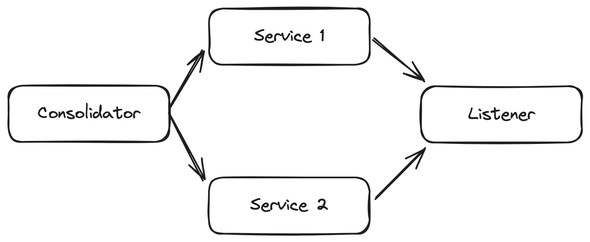

# Centralized Deployment for Ballerina

## Overview

This repository documents three approaches to achieve centralized deployment. These approaches are particularly useful when orchestration platforms like Kubernetes (K8s) are not available. In other words, they are suited for scenarios where the deployment leans toward a monolithic architecture, with a single runtime hosting multiple services on a virtual machine or similar setup.

## Single-Repository Solution

This approach involves using a single repository to group all your services. The code related to this solution is available in the `approach0` directory.

### Pros

- **Simplicity**: Easy to manage with a single repository.
- **Unified Workflow**: Enables a single workflow for building and deploying to a specific environment.

### Cons

- **Versioning and Branching Challenges**: Managing versions and branches can become complicated.
- **Rebuild Requirement**: Every change necessitates rebuilding all services, which can be time-consuming.

## Multi-Repository Solution

This approach uses multiple repositories to organize services. Each repository can contain one or more services, which are independently released as Ballerina packages. These packages are then pushed to Ballerina Central and shared with others. Subsequently, all packages are consolidated into a single runtime using a **`consolidator` program**. 

The code for this solution is available in the `approach2` directory. Below is a high-level dependency diagram illustrating this solution:

### Components

- **Consolidator**: Combines all services into a single process, which is then deployed to the target environment (Continuous Deployment - CD).
- **Service 1, Service 2**: Example services, designed, developed, and released independently (Continuous Integration - CI).
- **Listener**: Configures transport details such as host, port, SSL settings, etc.

### Pros

- **Straightforward Versioning**: Managing versions and branches is easier compared to a single repository setup.
- **Independent Releases**: Each service (or group of services) can be released independently.
- **Microservices Transition**: Facilitates a seamless transition from a monolithic architecture to a microservices-based deployment.

### Cons

- **Increased Effort**: Requires more work compared to the central repository approach (`approach0`).

### Note

`approach1` also falls under this category. However, `approach2` is preferred as it provides a smoother transition from a monolithic to a microservices-based deployment model.

## Deployment Practices

Ballerina does not support hot-deployment. Therefore, you must follow industry best practices to ensure zero downtime when deploying new versions to production. Recommended deployment strategies include:

- **Blue-Green Deployments**: Deploy the new version in parallel with the current version and switch traffic once validated.
- **Rolling Updates**: Gradually replace old instances with new ones without downtime.
- **Canary Releases**: Deploy the new version to a small subset of users first, then gradually expand once it is validated.

Following these practices ensures a smooth and reliable deployment process in production environments.
